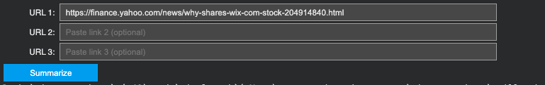
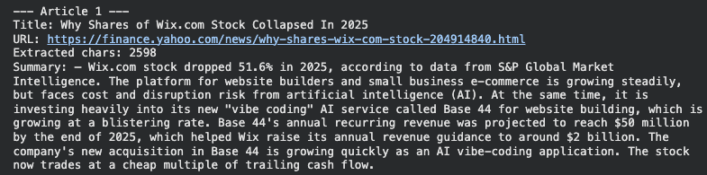

# News Article Summarizer (LLM)

A small, end-to-end project that **takes news article links (URLs)**, extracts the article text, and generates a **clean summary** using a transformer summarization model.

This repo is organized around two workflows:

1. **Train / fine-tune a summarization model** (notebook)
2. **Run inference from links** (notebook)

---

## Repo structure

```
.
├── assets/
│   ├── Summarize_UI.png
│   └── Summarize_output.png
├── notebooks/
│   ├── NewsSummarizationModel_Colab.pdf
│   └── runwithlinks_Colab.pdf
├── models/
│   └── .gitkeep
├── requirements.txt
└── LICENSE
```

> Notes:
> - `models/` is intentionally empty by default. Keep large model artifacts out of git and store them in releases, cloud storage, Hugging Face Hub, or Git LFS.

---

## Demo

### Paste up to 3 article links



### Example summarization output



---

## Quickstart (recommended: Google Colab)

1. Open `notebooks/runwithlinks_Colab.ipynb` and follow the steps in order.
2. Provide the fine-tuned model artifact (e.g., a zipped checkpoint produced by the training notebook).
3. Paste one or more URLs and run inference to generate summaries.

---

## How it works (high level)

### 1) Article ingestion
- Download + parse article text from a URL (commonly via `newspaper3k`).
- Light cleaning and truncation to keep inputs within model limits.

### 2) Summarization
- Tokenize the article text with a BART tokenizer.
- Run a fine-tuned sequence-to-sequence model to generate a short summary.

---

## Model & training (high level)

- **Base model:** `facebook/bart-large-cnn`
- **Training dataset:** Multi-News
- **Training approach:** fine-tune BART for abstractive summarization; save the resulting checkpoint for downstream inference.

---

## Running locally

Create a virtual environment and install dependencies:

```bash
python -m venv .venv
source .venv/bin/activate
pip install -r requirements.txt
```

> If you want GPU support locally, install the correct PyTorch build for your CUDA version (see PyTorch install instructions).

---

## Limitations

- Some publishers block scraping, require JavaScript rendering, or are behind paywalls.
- Generated summaries can be incomplete or occasionally incorrect—treat them as a reading aid, not ground truth.
- Scraping using newspaper3k doesn't always grab the correct text from the article.

---

## License

MIT (see `LICENSE`).
